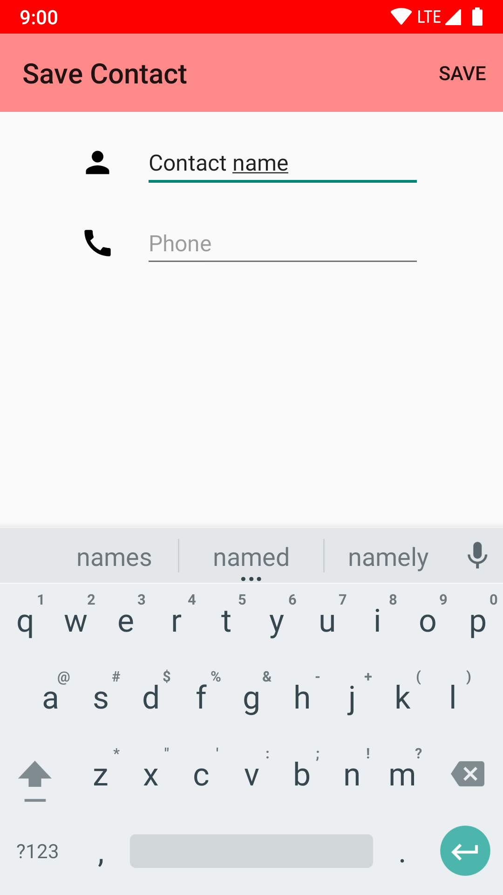

# Safety App - Mobile Application Development

  App is intended to send Multiple SMS with the last known Location with a "Emergency message".  
 - On Long press on **'Emergency'** button, **send SMS** in SafetyApp is initiated with a **5 Second timer**.  
 - App fetches your last know location recorded in you phone, this location will be sent to all the saved contacts in SafetyApp.    
 - A **'Cancel'** button appears to cancel the send SMS to all the saved contacts in case, mistakely send SMS is initiated.  
 - By this said, ofcourse there is **Add**, **update** & **delete** options for any saved contacts.  

## Software & Languages used
- Android Studio - Java, XML

## Sample SMS Recieved

## Screenshots of SafetyApp

|  |  |
|:-------------------------:|:-------------------------:|
| Home Page | Emergency Initiated|
|  ||
| Terminate SMS | Display Contact |
|||
| Save Contact | Save Contact |
|||

## Nerd
- App uses **Java Thread** concept to run Timer & send SMS seperately from main thread.

## Work Remaining
- Send Custom message as set in settings page.

### Any new ideas or updates are always welcome 🤗!
